

Introduction
------------

We are performing exploratory data analysis for a Fortune 1000 company.
We are examining employee attrition with the goal of identifying key
factors that contribute to attrition. Factors that prevent attrition
will also be examined. The data used was provided by the company and
includes information on 1470 full-time employees. Including attrition, a
total of 35 variables were measured for each employee. All data entries
were complete. (No N/A's in the dataset.) This included numeric data
such as age and income as well as categorical data such as their roles
and department they work in.

Project Goals
-------------

-   Identify (at least) the top three factors that contribute
    to turnover.

-   Learn about any job role specific trends that may exist in the data
    set

-   Provide any other interesting trends and observations from your
    analysis

Because we have a mix of categorical and numerical data in here, we are
going to split every integer column into binned values.This will allow
us to more easily compare clusters of employees to one another.

-   Now, let's find the base attrition rate

<!-- -->

    ## [1] "Number of NA's in attrition column:"

    ## [1] 0

    ## [1] "Number of Employees that quit:"

    ## [1] 237

    ## [1] "Ratio of Employees that quit:"

    ## [1] 0.1612245

-   237 total employees quit out of 1470 total (16.122 percent).

-   Now (Since we have binned all continous values) let's treat all
    values as categorical, and find out which of them have a higher than
    expected correlation with one another.

-   First we will create a vector which contains the lengths of all
    factor levels.

<!-- -->

    ## [1] "Average number of observations over all factor levels:"

    ## [1] 250.9756

    ## [1] "Number of different factor levels:"

    ## [1] 205

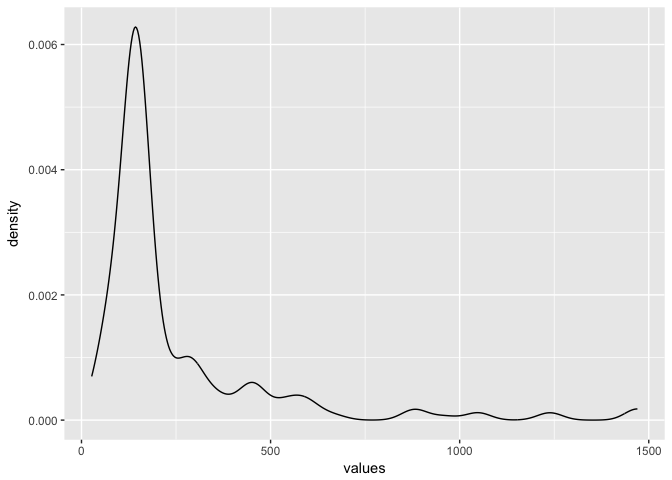

-   We have 205 different factor levels with a mean of 251 observations
    each, and most factor levels seem to have around 170 obserations, so
    we are fairly well distributed.

<!-- -->

    ## [1] "Average attrition rate for all factors:"

    ## [1] 0.1648296

    ## [1] "Median attrition rate for all factors"

    ## [1] 0.1500007

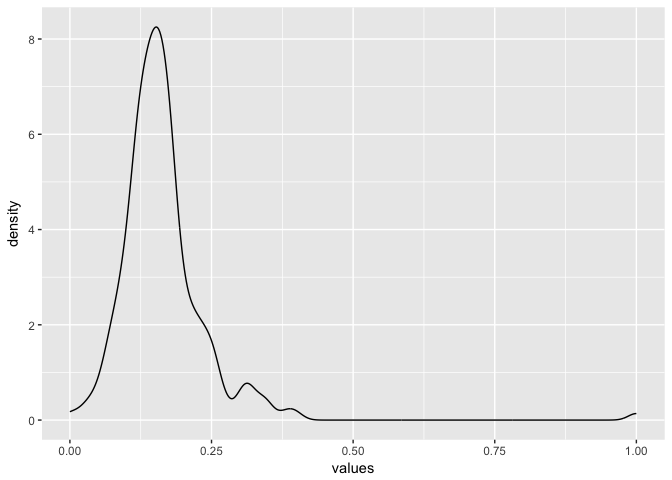

-   Unsuprisingly, our mean value for percent\_pos is exactly in line
    with the overall percent who quit, but the median value is notably
    lower, and we seem to have a small cluster of events hovering around
    33% quit; which is approximately double the standard rate.

-   Let's take a closer look at some of those varaibles

<!-- -->

    ## [1] "Factors with the highest attrition rates:"

    ##                                percent_pos num_obs ratio_delta
    ## jobrole&Sales Representative     0.3975911      83  0.23636660
    ## totalworkingyears&[ 0, 4)        0.3818186     165  0.22059407
    ## yearsatcompany&[ 0, 2)           0.3488375     215  0.18761302
    ## age&[18,27)                      0.3456794     162  0.18445493
    ## jobinvolvement&1                 0.3373502      83  0.17612571
    ## yearswithcurrmanager& 0          0.3231942     263  0.16196968
    ## monthlyincome&[ 1009, 2318)      0.3129256     147  0.15170115
    ## monthlyincome&[ 2318, 2696)      0.3129256     147  0.15170115
    ## worklifebalance&1                0.3125009      80  0.15127637
    ## overtime&Yes                     0.3052886     416  0.14406414
    ## yearsincurrentrole& 0            0.2991806     244  0.13795613
    ## trainingtimeslastyear&0          0.2777791      54  0.11655463
    ## joblevel&1                       0.2633519     543  0.10212740
    ## educationfield&Human Resources   0.2592620      27  0.09803751
    ## maritalstatus&Single             0.2553193     470  0.09409482

-   We see that Sales Representatives is the group with the highest
    leaving rate. All other job roles had attrition rates less than 26%,
    compared to the sales representative rate of 40%.
-   The next 3 highest groups are young people with little experience,
    both in working years and at the company. These three groups are
    not independent.
-   A high number of people leave at 0 years with their current manager.
    This could be related to inexperience/age or incompatibility with
    the manager.
-   People with low salaries leave at a higher rate. This again could be
    confounded in age/experience.

This paints a clear picture of the employee that is most likely to quit:
A young Sales Representative that is new at the company and is making
less than $2700 a month.

Overtime is one of the variables strongly correlated with quitting.
Because it is possibly the easiest to manage, we will examine it first.

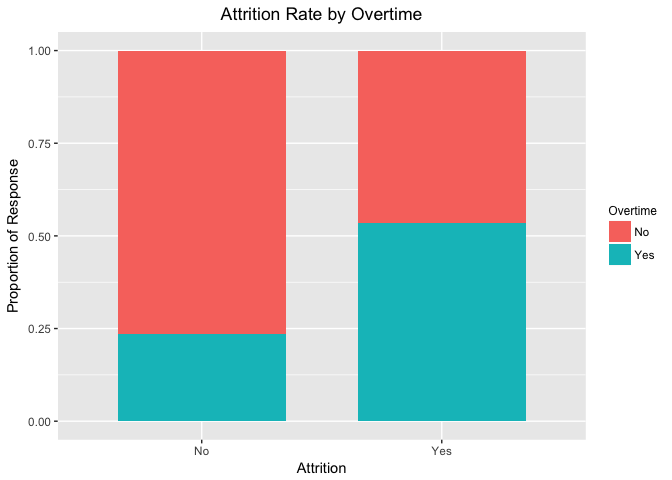

-   A bit over 50% of those who quit are working overtime, compared to
    less than 25% of those who did not quit.

We saw earlier that young employees and Sales Representatives are
quitting at high rates.

    ## [1] "Attrition rate of sales representatives between 18 and 27 years of age:"

    ## [1] 0.5714286

    ## [1] "Attrition rate of sales representatives older than 27:"

    ## [1] 0.3090909

    ## [1] "Attrition rate of employees age 18-27 that are not Sales Representatives:"

    ## [1] 0.2985075

    ## [1] "Attrition Rate of Sales Representatives Working Overtime:"

    ## [1] 0.6666667

    ## [1] "Attrition Rate of Employees Working Overtime (Excluding Sales Representatives:"

    ## [1] 0.2831633

57% of sales representatives between 18 and 27 years of age quit. This
is almost twice the rate of their peers and other sales representatives
outside of that age group. Overtime may contribute to the sales
representatives quitting. 67% of sales reps working overtime quit,
compared to 28% across all other roles.

    ## [1] "Proportion of Employees that quit that made less than $2318 monthly (excluding Sales Rep's):"

    ## [1] 0.2583333

    ## [1] "Proportion of Employees that quit that made between $2318 and $2696 monthly (excluding Sales Rep's):"

    ## [1] 0.312

Because we have already identified the high rate of attrition of sales
representatives, we excluded them from income level analysis. We see
that for other job roles, high attrition is still a problem for
lower-paid workers. Interestingly, the employees in the 10-20th
percentile of monthly income have a higher rate of attrition than the
lowest 10%.

One of the largest groups with a high attrition rate shown above is
those who are single, with 470 employees reported.

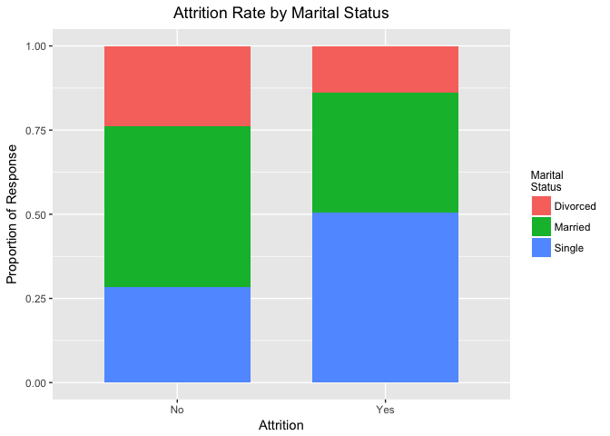

    ## [1] "Proportion of Employees that quit that are younger than 27 and single:"

    ## [1] 0.3

-   A majority of those who quit are single, but are only 25% of
    employees who did not quit are single.
-   30% of single employees that quit were less than 27 years old,
    compared to 11% of the employees surveyed. This variable also
    seems (partially) confounded with age.

Employees with a job involvement score of 1 also have relatively high
attrition rates.
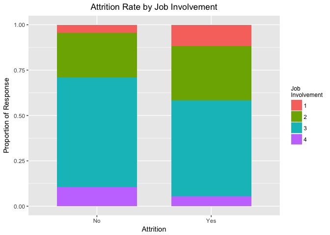

    ## [1] "Proportion of Employees that quit that are older than 27 with Very Low Job Involvement:"

    ## [1] 0.2142857

-   Employees with a Job Involvement score of 1 have a much higher rate
    of quitting relative to other scores.
-   21% of employees that quit with a Job Involvement score of 1 were
    under the age of 27. While this is lower proportion than those who
    are single, it appears that low job involvement may still be
    confounded with age.

It is also important to examine what factors are associated with not
quitting.

    ## [1] "Factors with the lowest attrition rates:"

    ##                                   percent_pos num_obs
    ## jobrole&Research Director          0.02500122      80
    ## monthlyincome&[13826,19999]        0.03401426     147
    ## joblevel&4                         0.04717071     106
    ## jobrole&Manager                    0.04902054     102
    ## yearswithcurrmanager&[10,17]       0.06000094     100
    ## yearsatcompany&[11,16)             0.06481568     108
    ## yearsincurrentrole&[10,18]         0.06542143     107
    ## jobrole&Healthcare Representative  0.06870300     131
    ## jobrole&Manufacturing Director     0.06896616     145
    ## joblevel&5                         0.07246511      69

-   Research Directors have an incredibly low rate of attrition.
-   Employees in the highest income bracket rarely quit.
-   Employees that have worked the same role with the same manager for
    about a decade rarely quit.

Many of these attributes are likely correlated.

But first we are going to have to generate our dummy varaibles across
the main dataset.

    ## [1] "Covariance of factors with high attrition rates:"

    ##        yearsatcompany&[ 0, 2)+yearswithcurrmanager& 0 
    ##                                             0.7680608 
    ##                 age&[18,27)+totalworkingyears&[ 0, 4) 
    ##                                             0.4666667 
    ##     totalworkingyears&[ 0, 4)+yearswithcurrmanager& 0 
    ##                                             0.3650190 
    ## monthlyincome&[ 2318, 2696)+totalworkingyears&[ 0, 4) 
    ##                                             0.3090910 
    ##    monthlyincome&[ 1009, 2318)+yearsatcompany&[ 0, 2) 
    ##                                             0.2604652 
    ##   monthlyincome&[ 1009, 2318)+yearswithcurrmanager& 0 
    ##                                             0.2243346 
    ##                  overtime&Yes+yearswithcurrmanager& 0 
    ##                                             0.1971154 
    ##               age&[18,27)+monthlyincome&[ 2318, 2696) 
    ##                                             0.1913581 
    ##              age&[18,27)+jobrole&Sales Representative 
    ##                                             0.1728396 
    ##   monthlyincome&[ 2318, 2696)+yearswithcurrmanager& 0 
    ##                                             0.1634981

-   Age, years at the company, and total working years and income are
    pairwise weakly correlated.
-   Because these are correlated with one another, this provides a small
    subset of workers that should be focused on retaining in order to
    decrease attrition.

-   Just for fun, let's see if we can find the most commonly correlated
    variables throughout the table

<!-- -->

    ## [1] "Number of covariant pairs:"

    ## [1] 10455

-   since it would be hard to look at all 10,455 covariant pairs, we
    will look at the histogram to see where most pairs lie

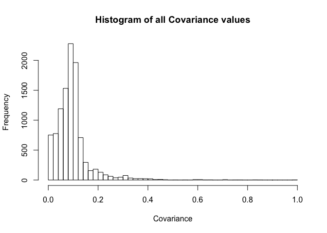

-   It looks like most of our variables are independent of the others.
    It is possible the surge in perfect correlation at the top is just
    due to groups with very small counts; so it's probably not worth
    looking much in to, we will examine some of the other items with a
    correlation of .6 or higher.

<!-- -->

    ## [1] "Highest Covariances:"

    ##                       over18&Y+performancerating&3 
    ##                                          0.8462585 
    ##                attrition&FALSE+performancerating&3 
    ##                                          0.8392283 
    ##                           attrition&FALSE+over18&Y 
    ##                                          0.8387755 
    ## department&Human Resources+jobrole&Human Resources 
    ##                                          0.8253969 
    ##     yearsatcompany&[ 0, 2)+yearswithcurrmanager& 0 
    ##                                          0.7680608 
    ##            maritalstatus&Single+stockoptionlevel&0 
    ##                                          0.7448494 
    ##       attrition&FALSE+businesstravel&Travel_Rarely 
    ##                                          0.7193836 
    ##                    overtime&No+performancerating&3 
    ##                                          0.7178457 
    ##                               over18&Y+overtime&No 
    ##                                          0.7170068 
    ##   businesstravel&Travel_Rarely+performancerating&3 
    ##                                          0.7146302 
    ##       businesstravel&Travel_Rarely+employeecount&1 
    ##                                          0.7095238 
    ##      businesstravel&Travel_Rarely+standardhours&80 
    ##                                          0.7095238 
    ##        department&Research/Development+overtime&No 
    ##                                          0.6546490 
    ##    department&Research/Development+employeecount&1 
    ##                                          0.6537415 
    ##   department&Research/Development+standardhours&80 
    ##                                          0.6537415 
    ##      yearsincurrentrole& 2+yearswithcurrmanager& 2 
    ##                                          0.6370968 
    ##                  attrition&FALSE+worklifebalance&3 
    ##                                          0.6212490 
    ##     businesstravel&Travel_Rarely+worklifebalance&3 
    ##                                          0.6126558 
    ##                  employeecount&1+worklifebalance&3 
    ##                                          0.6074830 
    ##                 standardhours&80+worklifebalance&3 
    ##                                          0.6074830 
    ##        department&Research/Development+gender&Male 
    ##                                          0.6056192 
    ##                    gender&Male+performancerating&3 
    ##                                          0.6028939 
    ##                        employeecount&1+gender&Male 
    ##                                          0.6000000 
    ##                       gender&Male+standardhours&80 
    ##                                          0.6000000

    ## [1] "Performance Rating = 3 Response Rate:"

    ## [1] 0.8462585

    ## [1] "Number of Performance Rating = 3 Responses:"

    ## [1] 1244

    ## [1] "Number of Employees with Performance Rating of 3 that quit:"

    ## [1] 200

-   It seems like there's a whole lot of fields which are highly
    correlated with a performance rating and a work life balance of 3.
    Perhaps this is an indicator that a performance rating of 3 means
    very little. In fact, it looks like 84% of all employees surveyed
    had a performance rating of 3. Additionally, 16 percent of employees
    with a performance rating of 3 quit, which is nearly exactly in line
    with the population estimate. Overall, this variable provides no
    significant information.
-   Many of these high covariances are related to employee count,
    standard hours, and rarely travelling for business. These are all
    variables in which a large number of employees have the same value,
    so unfortunately they provide little information.

Let's take a look at enviroment satisfaction. While it did not appear in
the highest covariance list, high environment satisfaction should be
part of a healthy work environment. Because employees spend so much time
at work, it could be a significant factor that was simply masked by the
thousands of other covariate pairs. Extended time in a bad environment
could also negatively impact job performance.

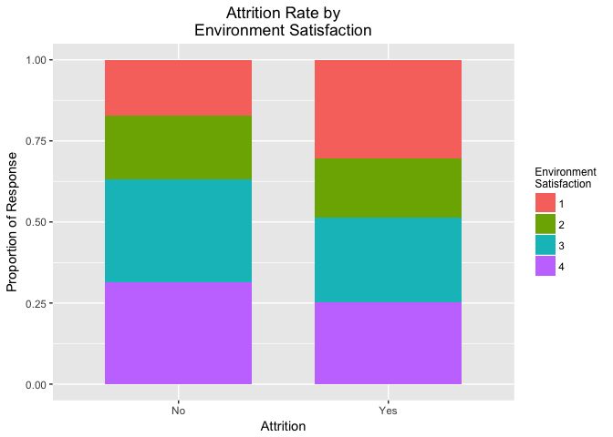
\* About 40% of employees who have not quit give an unfavorable
environment satisfaction rating. \* It appears that employees that quit
are expected to have lower Environment Satisfaction than those who do
not quit, but the distributions are not very different. \* Employees who
quit give a rating of 1 at roughly twice the rate of employees who do
not quit. It is reasonable to suspect that Environment Satisfaction is
correlated with overall happiness at work, so we would like to examine
other factors that are correlated with Environment Satisfaction.

    ## [1] 0.3884354

    ##                           percent_pos num_obs ratio_delta
    ## monthlyrate&[ 2094, 4605)   0.5034017     147  0.11496632
    ## jobrole&Research Director   0.4875006      80  0.09906527
    ## numcompaniesworked&2        0.4863017     146  0.09786635
    ## attrition&TRUE              0.4852323     237  0.09679691
    ## jobinvolvement&1            0.4819283      83  0.09349296
    ## education&5                 0.4791678      48  0.09073238

-   It looks the the features most highly correlated with environment
    satisfaction are a high monthly salary, having worked at one other
    company before, being at a company for a long time, feeling involved
    at your company, and having quit your job. It seems to also help if
    you are a research director.

Because age was related to attrition rate, we would also like to examine
education level to determine whether there are any trends there.
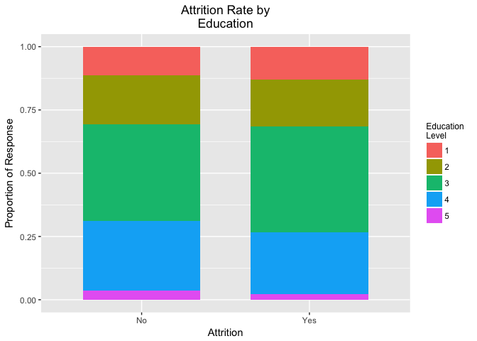

-   There seems to be no significant relationship between education
    level and attrition. This is good news, as the education level of
    the company remains high.
-   Looking at the education levels of employees in the company, 31
    percent of those surveyed do not have a Bachelor's degree (Education
    Level &lt; 3), and 30 percent have a masters degree or higher
    (Education Level &gt; 3). We are going to make the split at
    University level (so all employees with a Bachelor's degree or
    higher will be associated with the label TRUE)

<!-- -->

    ## [1] 0.692517

    ## [1] "Covariances with Bachelor's+ Education Level"

    ##                                percent_pos num_obs ratio_delta
    ## educationfield&Human Resources   0.8518524      27  0.15933539
    ## numcompaniesworked&4             0.8345325     139  0.14201549
    ## totalworkingyears&[14,18)        0.8085108     141  0.11599377
    ## numcompaniesworked&9             0.8076927      52  0.11517567
    ## yearsincurrentrole&[10,18]       0.7943927     107  0.10187571
    ## yearssincelastpromotion&[5, 8)   0.7843139     153  0.09179686
    ## age&[35,37)                      0.7823131     147  0.08979607
    ## yearswithcurrmanager&[10,17]     0.7800002     100  0.08748321
    ## totalworkingyears&[24,40]        0.7769232     130  0.08440624
    ## age&[51,60]                      0.7762239     143  0.08370693

-   The most interesting thing here is that it seems many employees in
    HR have similar education levels. Closer examination indicates that
    most of these employees have at least a Bachelor's degree.  
-   Similarly, working for multiple companies is correlated
    with education. Closer examination again indicates that these many
    of these employees have at least a Bachelor's degree.

We would also like to examine how life outside of work may influence an
employee's decision to quit. We will specifically look at relationship
satisfaction and work-life balance for employees.

    ## [1] "Overall Relationship Satisfaction for All Employees"

    ## 
    ##         1         2         3         4 
    ## 0.1877551 0.2061224 0.3122449 0.2938776

-   Moving onto relationship satisfaction, it looks like 60% of people
    claim to be happy in thier relationship, so we will split this
    variable at the same place we've split the last two. In this case we
    will say True if a relationship is at least a level 3 in
    satisfaction (or higher).
-   In terms of attrtion, relationship satisfaction appears unrelated.
    Employees with a relationship satisfaction rating of 1 do quit at a
    slightly higher rate, however.

<!-- -->

    ## [1] 0.6061224

    ## [1] "Covariances with Positive Relationship Satisfaction:"

    ##                                percent_pos num_obs ratio_delta
    ## educationfield&Human Resources   0.7777786      27  0.17165615
    ## yearsincurrentrole& 1            0.7368426      57  0.13072012
    ## jobrole&Human Resources          0.7307697      52  0.12464730
    ## employeenumber&[   1, 199)       0.7074832     147  0.10136074
    ## department&Human Resources       0.6984132      63  0.09229073
    ## yearswithcurrmanager& 1          0.6973688      76  0.09124637
    ## numcompaniesworked&8             0.6938782      49  0.08775573
    ## numcompaniesworked&7             0.6891896      74  0.08306716
    ## hourlyrate&[74, 81)              0.6887419     151  0.08261948
    ## dailyrate&[ 804, 943)            0.6780824     146  0.07195996

    ## [1] "Human Resources Relationship Satisfaction:"

    ## 
    ## FALSE  TRUE 
    ##    14    38

    ## [1] "Second Year Employee Relationship Satisfaction:"

    ## 
    ## FALSE  TRUE 
    ##    15    42

    ## [1] "Journeyman Employee Relationship Satisfaction:"

    ## 
    ## FALSE  TRUE 
    ##    38    85

-   Once again human resources is right there at the top of our list
    both in job role, department, and education field, so apparently
    everyone in our test set who works in eduacation has a bachelors
    degree or higher, and is in a happy relationship. There is also
    evidence that being happy in a relationship is not correlated with
    how loyal you are to your job, as employees who have worked at 8
    comapnies seem to be happy in thier relationship.

<!-- -->

    ## [1] 0.2938776

    ## [1] "Covariances with Very High Relationship Satisfaction:"

    ##                                percent_pos num_obs ratio_delta
    ## yearsincurrentrole& 1            0.4035098      57  0.10963227
    ## trainingtimeslastyear&0          0.3888900      54  0.09501247
    ## yearswithcurrmanager& 1          0.3815798      76  0.08770221
    ## employeenumber&[   1, 199)       0.3809528     147  0.08707525
    ## yearsatcompany& 2                0.3700792     127  0.07620169
    ## yearssincelastpromotion&[8,15]   0.3644866     107  0.07060902

-   An interesting observation when we only count those who give a
    relationship satisfaction as 'very high' is that HR disappears from
    the top of our list. Correlation in general drops significantly, for
    example employees with 1 year in their current role drops from 0.737
    to 0.404 when we examine if employees rate their relationship
    satisfaction 'very high'.

-   Moving onto work life balance, it looks like ~70% of employees who
    do not quit claim to have a good work-life balance, compared to ~65%
    of those who quit.
-   While work-life balance does not predict attrition well, employees
    with very poor work-life balance are more likely to quit.

<!-- -->

    ## [1] 0.1040816

    ## [1] "Covariances with Positive Work-Life Balance:"

    ##                            percent_pos num_obs ratio_delta
    ## jobrole&Human Resources      0.1923092      52  0.08822761
    ## numcompaniesworked&4         0.1870509     139  0.08296931
    ## department&Human Resources   0.1587315      63  0.05464986
    ## age&[42,46)                  0.1578953     152  0.05381366
    ## employeenumber&[1237,1449)   0.1564632     147  0.05238153
    ## yearsincurrentrole& 4        0.1538470     104  0.04976533

-   The correlation with work-life balance is not very strongly
    correlated with other, unlike the other variables examined.
-   Interestingly, HR again appears as the Job Role most correlated with
    this variable.

From the limited data we have, life outside of the office does not
appear to influence attrition in a significant way. But employees that
provide very low ratings in these metrics do have a slightly higher rate
of quitting.

Conclusion
----------

-   Sales representatives and young, new employees have the
    highest turnover.
-   A disporoportionate number of people that quit worked overtime.
-   Many groups with high attrition rates are disproportionately young.
-   We have a loyal employee base. People who work here a long time
    often stay.
-   Life of employees outside of the office does not appear strongly
    related to attrition.

APPENDIX (Classification Model)
===============================

Linear Model For Predicting Employee Retention
----------------------------------------------

-   We are going to try to build a model using linear regression. Since
    linear regression isn't typically used for classification, we will
    be coxing the model into making predictions. Since the source code
    for this operation gets a little cumbersome, it it will retained in
    the source directory.

-   The goal is to change the label value to have a score from 0-100
    (since all labels are binary, they will either be 1 or 100). We will
    then use some of the feature generation techniques to collect some
    variables we may find interesing. Then, using a train-test-split, we
    will test our model against a reserved subset of the data-set.

-   Since the goal is classification, we will be using a threshold value
    to measure model performance. The other hyper-parameter we will be
    tuning is the percentage of total variables we will be using in
    the dataframe. Both of these values with thier predictive outputs
    are plotted below.

<!-- -->

    

#### Plot of model accuracy vs percentage of variables included in the frame

    ##    threslist    m_perf
    ## 82        82 0.5510204

   

#### Plot of model accuracy vs threshold value

    ##     varquant    m_perf
    ## 0.3      0.3 0.5617978

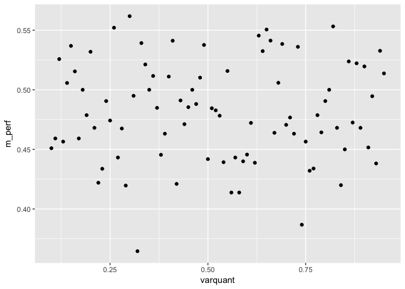

-   Unfortunatly, It doesn't look like adding and subtracting variables
    has any effect on model performance; which is a little weird, but
    the chart above seems to show a completley random cloud; so our
    final model is about 55% accurate at measuring employee retention;
    which is probably an indication that it just doesn't make a whole
    lot of sese to use linear-regression for classification.

### Linear model For Prediciting Employee Education Level

-   Fully aware that our model doesn't seem to work, we decided it
    wouldn't hurt to try to model another factor. This time we are going
    to try to predict if an employee has a pHD.

<!-- -->

    

plot of model accuracy vs percentage of variables included in the frame
-----------------------------------------------------------------------

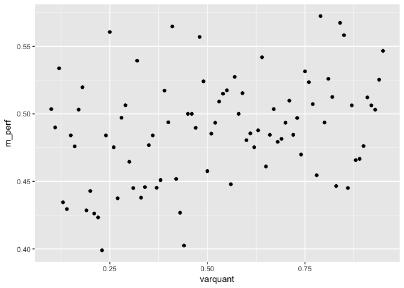

  

Plot of model accuracy vs threshold value
-----------------------------------------

    ##    threslist  m_perf
    ## 82        82 0.59375

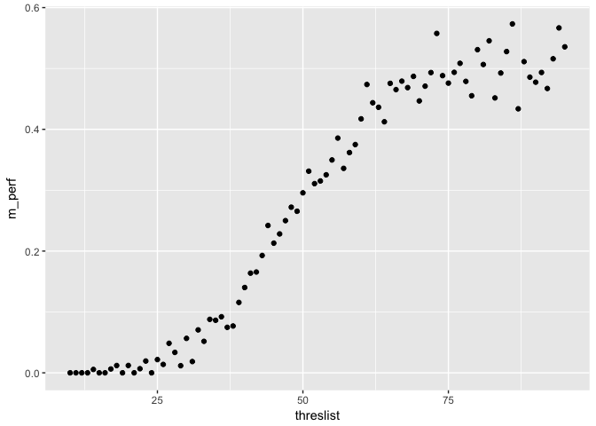

-   This looks like a nail in the coffin for linear-regression as
    a classifier. Our model for predicting if an employee has a pHD is
    exactly as good as flipping a coin.
