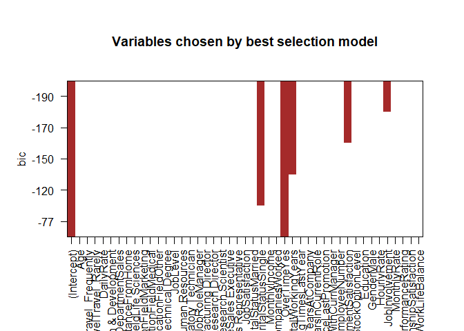
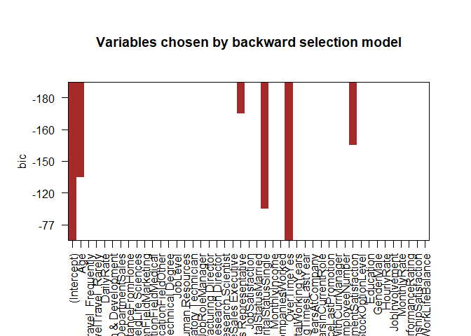
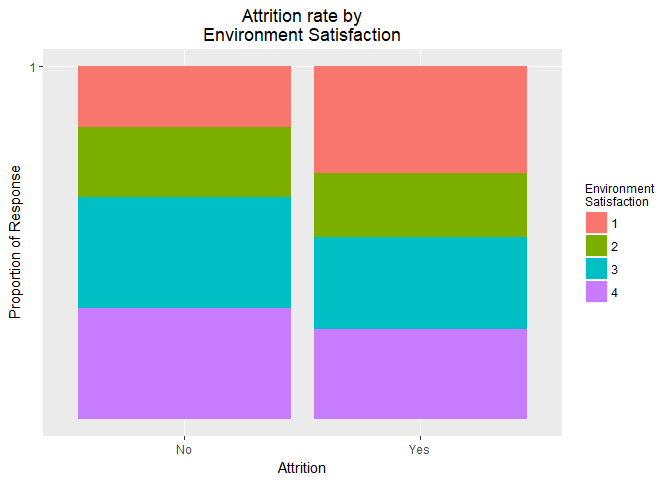
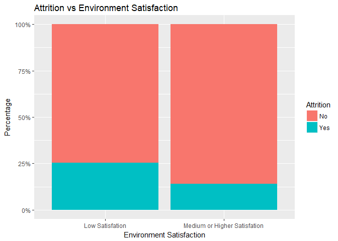
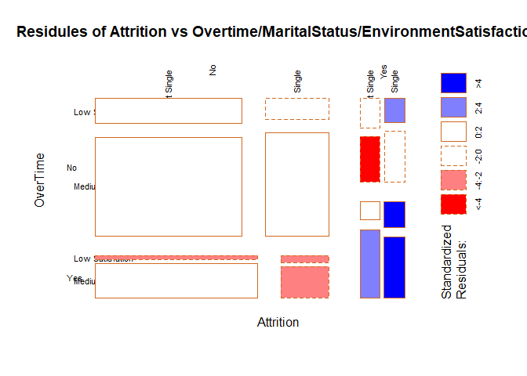
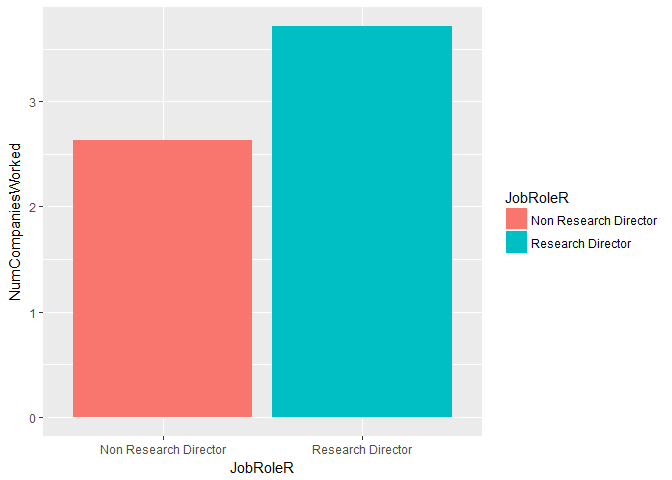

# MSDS6306 CaseStudy 2
December 4, 2017  

## 1. Project Goals 

###Identify (at least) the top three factors that contribute to turnover.
###Learn about any job role specific trends that may exist in the data set


```
## Warning in library(package, lib.loc = lib.loc, character.only = TRUE,
## logical.return = TRUE, : there is no package called 'tidyverse'
```

## 2. import data 


## 3. Initial Data Exploration 

###  3.1 Check for NAs and Nulls  
### - there is no NAs or Nulls in the dataset.

```r
unlist(lapply(employee, function(x) any(is.na(x))))
```

```
##                      Age                Attrition           BusinessTravel 
##                    FALSE                    FALSE                    FALSE 
##                DailyRate               Department         DistanceFromHome 
##                    FALSE                    FALSE                    FALSE 
##                Education           EducationField            EmployeeCount 
##                    FALSE                    FALSE                    FALSE 
##           EmployeeNumber  EnvironmentSatisfaction                   Gender 
##                    FALSE                    FALSE                    FALSE 
##               HourlyRate           JobInvolvement                 JobLevel 
##                    FALSE                    FALSE                    FALSE 
##                  JobRole          JobSatisfaction            MaritalStatus 
##                    FALSE                    FALSE                    FALSE 
##            MonthlyIncome              MonthlyRate       NumCompaniesWorked 
##                    FALSE                    FALSE                    FALSE 
##                   Over18                 OverTime        PercentSalaryHike 
##                    FALSE                    FALSE                    FALSE 
##        PerformanceRating RelationshipSatisfaction            StandardHours 
##                    FALSE                    FALSE                    FALSE 
##         StockOptionLevel        TotalWorkingYears    TrainingTimesLastYear 
##                    FALSE                    FALSE                    FALSE 
##          WorkLifeBalance           YearsAtCompany       YearsInCurrentRole 
##                    FALSE                    FALSE                    FALSE 
##  YearsSinceLastPromotion     YearsWithCurrManager 
##                    FALSE                    FALSE
```

```r
unlist(lapply(employee, function(x) any(is.null(x))))
```

```
##                      Age                Attrition           BusinessTravel 
##                    FALSE                    FALSE                    FALSE 
##                DailyRate               Department         DistanceFromHome 
##                    FALSE                    FALSE                    FALSE 
##                Education           EducationField            EmployeeCount 
##                    FALSE                    FALSE                    FALSE 
##           EmployeeNumber  EnvironmentSatisfaction                   Gender 
##                    FALSE                    FALSE                    FALSE 
##               HourlyRate           JobInvolvement                 JobLevel 
##                    FALSE                    FALSE                    FALSE 
##                  JobRole          JobSatisfaction            MaritalStatus 
##                    FALSE                    FALSE                    FALSE 
##            MonthlyIncome              MonthlyRate       NumCompaniesWorked 
##                    FALSE                    FALSE                    FALSE 
##                   Over18                 OverTime        PercentSalaryHike 
##                    FALSE                    FALSE                    FALSE 
##        PerformanceRating RelationshipSatisfaction            StandardHours 
##                    FALSE                    FALSE                    FALSE 
##         StockOptionLevel        TotalWorkingYears    TrainingTimesLastYear 
##                    FALSE                    FALSE                    FALSE 
##          WorkLifeBalance           YearsAtCompany       YearsInCurrentRole 
##                    FALSE                    FALSE                    FALSE 
##  YearsSinceLastPromotion     YearsWithCurrManager 
##                    FALSE                    FALSE
```


###  3.2 Initial inspect of all columns. Drop irrelevant columns that has only 1 level of values. 

```r
employee<-employee[,!(names(employee) %in% c("Over18","EmployeeCount","StandardHours"))]
```

### 3.3  Check factor column,Add numeric columns for factor columns for building correlation matric and regression model 


```r
# ename<-names(employee)
fnames<-names(Filter(is.factor, employee))

employee$BusinessTravelN<-as.numeric(employee$BusinessTravel)
employee$OverTimeN<-as.numeric(employee$OverTime)
employee$DepartmentN<-as.numeric(employee$Department)
employee$EducationFieldN<-as.numeric(employee$EducationField)
employee$GenderN<-as.numeric(employee$Gender)
employee$OverTimeN<-as.numeric(employee$OverTime)
employee$MaritalStatusN<-as.numeric(employee$MaritalStatus)
employee$JobInvolvementN<-as.numeric(employee$JobInvolvement)
employee$JobRoleN<-as.numeric(employee$JobRole)
employee$AttritionN<-as.numeric(employee$Attrition)
employee$AgeGroups <- cut(employee$Age, breaks = 5)
```
### 3.4 Build Correlation matrix for all numeric variables 
### Get an initially look of the data and all correlated variables

```r
## Fix an issue that existed in psych package that might impact ggplot function.
 #devtools::install_github("Artjom-Metro/ggsignif")
 nnames<-names(Filter(is.numeric,employee))
 #lowerCor(employee[,nnames])
```

## 4. Attrition Analysis. 

### 4.1 Run automatic methods for variable selection from the choosen variables. 


```r
regBest<- regsubsets(Attrition ~ Age + BusinessTravel + DailyRate +Department  + DistanceFromHome + 
                     EducationField + JobLevel+ JobRole +JobSatisfaction +MaritalStatus +
                     MonthlyIncome + NumCompaniesWorked + OverTime + TotalWorkingYears + 
                     TrainingTimesLastYear + YearsAtCompany + YearsInCurrentRole +
                     YearsSinceLastPromotion + YearsWithCurrManager
                    ## Variables Need further inspection 
                    + EmployeeNumber + EnvironmentSatisfaction + StockOptionLevel
                    + StockOptionLevel + YearsSinceLastPromotion 
                    + Education + Gender + HourlyRate + JobInvolvement
                    + MonthlyRate + PerformanceRating + RelationshipSatisfaction
                    + WorkLifeBalance
                    ## Variables unnessesary
                    ## + Over18 + EmployeeCount + StandardHours
                    ,
                  data = employee, nvmax = 5) 

# summary(regBest)
plot(regBest,col = "brown",main = "Variables chosen by best selection model")
```

<!-- -->

```r
regBack<- regsubsets(Attrition ~ Age + BusinessTravel + DailyRate +Department  + DistanceFromHome + 
                       EducationField + JobLevel+ JobRole +JobSatisfaction +MaritalStatus +
                       MonthlyIncome + NumCompaniesWorked + OverTime + TotalWorkingYears + 
                       TrainingTimesLastYear + YearsAtCompany + YearsInCurrentRole +
                       YearsSinceLastPromotion + YearsWithCurrManager
                     ## Variables Need further inspection 
                     + EmployeeNumber + EnvironmentSatisfaction + StockOptionLevel
                     + StockOptionLevel + YearsSinceLastPromotion
                     + Education + Gender + HourlyRate + JobInvolvement
                     + MonthlyRate + PerformanceRating + RelationshipSatisfaction
                     + WorkLifeBalance
                     ## Variables unnessesary
                     ## + Over18 + EmployeeCount + StandardHours 
                     ,
                     data = employee, nvmax = 5, method = "backward") 
#summary(regBack)
plot(regBack,col = "brown",main = "Variables chosen by backward selection model")
```

<!-- -->
### From the backward selection model,top 5 Variables impacting Attrition the most are: 
### OverTime(Yes),MaritalStatus(Single), Age,EnvironmentSatisfaction,JobRole(Sales)
### From the best selection model,top 5 Variables impacting Attrition the most are: 
### OverTime(Yes),MaritalStatus(Single),TotalWorkingYears,EnvironmentSatisfaction,JobInvolvement

### Therefore, we would choose OverTime, MaritalStatus, EnvironmentSatisfaction, TotalWorkingYears, Age, JobInvolvement and JobRole for further analysis.

### 4.2 Further variance inspection 


```r
##<<<<<<< HEAD

#### Probabilities of value given attrition #### 

attrified <- employee[employee$Attrition == 'Yes',]
not.attrified <- employee[employee$Attrition == 'No', ]

Attrition_prop_table <- function(variable_name, data.f){
    # Generates a table containing proportion of responses for both Attrition values. This should allow us to examine values in the context of whether they attrified.
    
    # Generate a table containing variable/Attrition rates
    prop <-prop.table(xtabs(as.formula(paste( '~ ',paste(variable_name, 'Attrition ', sep = ' + '))) , data=data.f))
    
    #Normalize each column to sum to 1.
    prop.app <-apply(prop,2,sum)
    return(melt(sweep(prop, MARGIN=2,prop.app,'/')))
}


EnvSatTest_attrit <- Attrition_prop_table('EnvironmentSatisfaction',employee)
MariStat_attrit <- Attrition_prop_table( 'MaritalStatus',employee)
```
### Employees that left are most likely to be single.

```r
OverTime_attrit <- Attrition_prop_table( 'OverTime',employee)
JobInvolv_attrit <- Attrition_prop_table( 'JobInvolvement',employee)
JobRole_attrit <- Attrition_prop_table( 'JobRole',employee)
```
### We have highest relative turnover of Sales Representative. Very few Research Directors leave.

```r
AgeGroup_attrit <- Attrition_prop_table( 'AgeGroups', employee)
```
### Younger employees are more likely to leave.

```r
table(employee[employee$Age < 26.4,'JobRole']) # Lab Tech, Research Scientist, 
```

```
## 
## Healthcare Representative           Human Resources 
##                         3                         7 
##     Laboratory Technician                   Manager 
##                        50                         0 
##    Manufacturing Director         Research Director 
##                         8                         0 
##        Research Scientist           Sales Executive 
##                        43                        23 
##      Sales Representative 
##                        28
```

```r
table(employee[employee$Age < 26.4 & employee$Attrition =='Yes','JobRole']) 
```

```
## 
## Healthcare Representative           Human Resources 
##                         0                         4 
##     Laboratory Technician                   Manager 
##                        20                         0 
##    Manufacturing Director         Research Director 
##                         1                         0 
##        Research Scientist           Sales Executive 
##                        10                         5 
##      Sales Representative 
##                        16
```
### Sales Rep, Lab Tech, Research Scientist are the jobs most often left.

```r
##<<<<<<< HEAD
## 100% Stacked Bar chart
ggplot(EnvSatTest_attrit, aes(x=Attrition, y=value, fill= factor(EnvironmentSatisfaction))) + 
    geom_bar(position = "fill",stat = "identity") +
    scale_y_continuous(breaks = c(1,2,3,4)) +
    labs(title = 'Attrition rate by\nEnvironment Satisfaction', y='Proportion of Response') +
    guides(fill=guide_legend(title="Environment \nSatisfaction"))+
    theme(legend.title=element_text(size = 9),plot.title=element_text(hjust=0.5))
```

<!-- -->

### 4.3 We'll go ahead and create multiple linear regression model to get more evidence in order to determine which factors imapct Atrrition the most. 

### Build regression model

```r
mylm<-lm(AttritionN ~ OverTimeN + MaritalStatusN + EnvironmentSatisfaction + TotalWorkingYears+ Age + JobInvolvementN + JobRoleN, data = employee)
summary(mylm)
```

```
## 
## Call:
## lm(formula = AttritionN ~ OverTimeN + MaritalStatusN + EnvironmentSatisfaction + 
##     TotalWorkingYears + Age + JobInvolvementN + JobRoleN, data = employee)
## 
## Residuals:
##      Min       1Q   Median       3Q      Max 
## -0.53443 -0.19839 -0.10137  0.01099  1.20262 
## 
## Coefficients:
##                          Estimate Std. Error t value Pr(>|t|)    
## (Intercept)              1.165893   0.070802  16.467  < 2e-16 ***
## OverTimeN                0.211636   0.019792  10.693  < 2e-16 ***
## MaritalStatusN           0.072902   0.012252   5.950 3.35e-09 ***
## EnvironmentSatisfaction -0.040833   0.008149  -5.011 6.08e-07 ***
## TotalWorkingYears       -0.005481   0.001565  -3.503 0.000474 ***
## Age                     -0.002675   0.001331  -2.009 0.044677 *  
## JobInvolvementN         -0.063763   0.012506  -5.099 3.87e-07 ***
## JobRoleN                 0.003063   0.003659   0.837 0.402676    
## ---
## Signif. codes:  0 '***' 0.001 '**' 0.01 '*' 0.05 '.' 0.1 ' ' 1
## 
## Residual standard error: 0.3404 on 1462 degrees of freedom
## Multiple R-squared:  0.1476,	Adjusted R-squared:  0.1435 
## F-statistic: 36.17 on 7 and 1462 DF,  p-value: < 2.2e-16
```
### factors significant are:  OverTimeN,MaritalStatusN,EnvironmentSatisfaction,JobInvolvementN,TotalWorkingYears and Age.
### Select top 3 factors that contribut to attrition the most
### The top 3 factors are: OverTime,EnvironmentSatisfaction,MaritalStatus, 

### 4.4 Combine values in the factors for further analysis. 

```r
employee$MaritalStatusR<-as.character(employee$MaritalStatus)
employee$MaritalStatusR[employee$MaritalStatusR!="Single"]<-c("Not Single")
employee$EnvironmentSatisfactionR<-employee$EnvironmentSatisfaction
employee$EnvironmentSatisfactionR[employee$EnvironmentSatisfaction!=1]<-c("Medium or Higher Satisfation")
employee$EnvironmentSatisfactionR[employee$EnvironmentSatisfaction==1]<-c("Low Satisfation")
```
### 4.5 Plot the data 

```r
bg<-ggplot(employee, aes(x=OverTime,fill=Attrition))
bg<-bg + geom_bar(position = "fill")
bg<-bg + scale_y_continuous(labels = scales::percent)
bg<-bg + labs(y="Percentage", x="Over Time", title="Attrition vs OverTime")
bg
```

<!-- -->

```r
bg<-ggplot(employee, aes(x=MaritalStatusR,fill=Attrition))
bg<-bg + geom_bar(position = "fill")
bg<-bg + scale_y_continuous(labels = scales::percent)
bg<-bg + labs(y="Percentage", x="MaritalStatus", title="Attrition vs MaritalStatus")
bg
```

<!-- -->

```r
bg<-ggplot(employee, aes(x=EnvironmentSatisfactionR,fill=Attrition))
bg<-bg + geom_bar(position = "fill")
bg<-bg + scale_y_continuous(labels = scales::percent)
bg<-bg + labs(y="Percentage", x="Environment Satisfaction", title="Attrition vs Environment Satisfaction")
bg
```

<!-- -->
### 4.6 Plot masaic plot for combing multiple factor's effection 

#### From the analysis, we can get the top 3 factors that contribuilt to a higher turnover rate of an employee:
#### 1. Working overtime.
#### 2. Being single.
#### 3. Low satisfaction of working enviorment.


```r
bg<-ggplot(employee)
bg<-bg + geom_mosaic(aes( x = product(MaritalStatusR,OverTime,EnvironmentSatisfactionR),
                          fill=Attrition)) 
bg<-bg + theme(axis.text.x=element_text(angle=35, hjust= 1))
bg<-bg + labs(x="Marital Status, Eviroment Satisfaction", title='Emploree attrition vs Overtime/MaritalStatus/EnvironmentSatisfaction',divider= "hspine")
bg<-bg + guides(fill=guide_legend(reverse = TRUE))
bg
```

<!-- -->

```r
mosaicplot(~Attrition + OverTime + MaritalStatusR + EnvironmentSatisfactionR, 
           shade = T, data = employee ,
           main = "Residules of Attrition vs Overtime/MaritalStatus/EnvironmentSatisfaction",
           las = 5,
           border = "chocolate",
           off = 10
)
```

<!-- -->

## 5. Job Role Analysis. 

### 5.1 There are nine job roles in the dataset 

```r
levels(employee$JobRole)
```

```
## [1] "Healthcare Representative" "Human Resources"          
## [3] "Laboratory Technician"     "Manager"                  
## [5] "Manufacturing Director"    "Research Director"        
## [7] "Research Scientist"        "Sales Executive"          
## [9] "Sales Representative"
```

###  5.2 Initial factors Screen. Chose a meaningful factor for analysis: Numer of the Companies Worked. 

### 5.3 Create subset for Analysis 

```r
sub.JRNCW<-employee[,c("NumCompaniesWorked","JobRole","JobRoleN")]
mean.JRNCW<-ddply(employee,~JobRole,summarise,meanNCW=mean(NumCompaniesWorked))
```

###  5.4 Build model and interpret the results 

```r
lm1<-lm(formula = NumCompaniesWorked ~ JobRole, data = sub.JRNCW)
summary(lm1)
```

```
## 
## Call:
## lm(formula = NumCompaniesWorked ~ JobRole, data = sub.JRNCW)
## 
## Residuals:
##     Min      1Q  Median      3Q     Max 
## -3.7125 -1.7209 -0.7655  1.2875  6.5274 
## 
## Coefficients:
##                               Estimate Std. Error t value Pr(>|t|)    
## (Intercept)                    2.90840    0.21619  13.453  < 2e-16 ***
## JobRoleHuman Resources         0.05314    0.40557   0.131  0.89577    
## JobRoleLaboratory Technician  -0.32925    0.26529  -1.241  0.21478    
## JobRoleManager                 0.17003    0.32675   0.520  0.60288    
## JobRoleManufacturing Director -0.14288    0.29827  -0.479  0.63199    
## JobRoleResearch Director       0.80410    0.35111   2.290  0.02215 *  
## JobRoleResearch Scientist     -0.43579    0.26021  -1.675  0.09419 .  
## JobRoleSales Executive        -0.18754    0.25597  -0.733  0.46389    
## JobRoleSales Representative   -1.28189    0.34714  -3.693  0.00023 ***
## ---
## Signif. codes:  0 '***' 0.001 '**' 0.01 '*' 0.05 '.' 0.1 ' ' 1
## 
## Residual standard error: 2.474 on 1461 degrees of freedom
## Multiple R-squared:  0.02412,	Adjusted R-squared:  0.01878 
## F-statistic: 4.514 on 8 and 1461 DF,  p-value: 1.957e-05
```
### Research Director and Sales representative shows significant difference in number of companies worked than other roles.

```r
sub.JRNCW$JobRoleR<-as.character(sub.JRNCW$JobRole)
sub.JRNCW$JobRoleR[sub.JRNCW$JobRoleR!="Research Director"]<-c("Non Research Director")

sub.JRNCW$JobRoleS<-as.character(sub.JRNCW$JobRole)
sub.JRNCW$JobRoleS[sub.JRNCW$JobRoleS!="Sales Representative"]<-c("Non Sales")
```

###Significant evidence shows that the mean number of companies that a Research Director had ever worked is greater than other roles. 
###p-vlue=0.00017 at significant level alpha=0.05
### 95% confidence level of how many more companies a Reseach Director had every worked is 0.5 to 1.6.

```r
aov1<-aov(NumCompaniesWorked~JobRoleR,data = sub.JRNCW)
summary(aov1)
```

```
##               Df Sum Sq Mean Sq F value  Pr(>F)    
## JobRoleR       1     88   87.90   14.21 0.00017 ***
## Residuals   1468   9079    6.18                    
## ---
## Signif. codes:  0 '***' 0.001 '**' 0.01 '*' 0.05 '.' 0.1 ' ' 1
```

```r
confint(aov1)
```

```
##                               2.5 %   97.5 %
## (Intercept)               2.5036900 2.765375
## JobRoleRResearch Director 0.5170978 1.638837
```
###Significant evidence shows that the mean number of companies that a Sales Representative had ever worked is less than other roles. 
### p-vlue=<0.0001. at significant level alpha=0.05
### 95% confidence level shows: The companies that a Sales Representative have ever worked is 0.5 to 1.7 less than other groups of roles.

```r
aov2<-aov(NumCompaniesWorked~JobRoleS,data = sub.JRNCW)
summary(aov2)
```

```
##               Df Sum Sq Mean Sq F value   Pr(>F)    
## JobRoleS       1    100  100.09   16.21 5.97e-05 ***
## Residuals   1468   9067    6.18                     
## ---
## Signif. codes:  0 '***' 0.001 '**' 0.01 '*' 0.05 '.' 0.1 ' ' 1
```

```r
confint(aov2)
```

```
##                                  2.5 %     97.5 %
## (Intercept)                   2.626134  2.8879254
## JobRoleSSales Representative -1.681389 -0.5796582
```
###  5.5 Conclusion:  
### From the analysis, Sales Representative workes less companies than other groups of roles and Research Director works more companies than other group of roles.
### But this results might be impacted by confound variances. Such as , Sales Representative's Age, working years and so on. Further analysis need to proceed on the test to determine confound variables.

```r
bg<-ggplot(sub.JRNCW, aes())
bg<-bg + geom_bar(aes(x=JobRoleR, y=NumCompaniesWorked, fill = JobRoleR), 
                  position = "dodge", stat = "summary", fun.y = "mean")
bg
```

<!-- -->

```r
bg<-ggplot(sub.JRNCW, aes())
bg<-bg + geom_bar(aes(x=JobRoleS, y=NumCompaniesWorked, fill = JobRoleS), 
                  position = "dodge", stat = "summary", fun.y = "mean")
bg
```

<!-- -->
